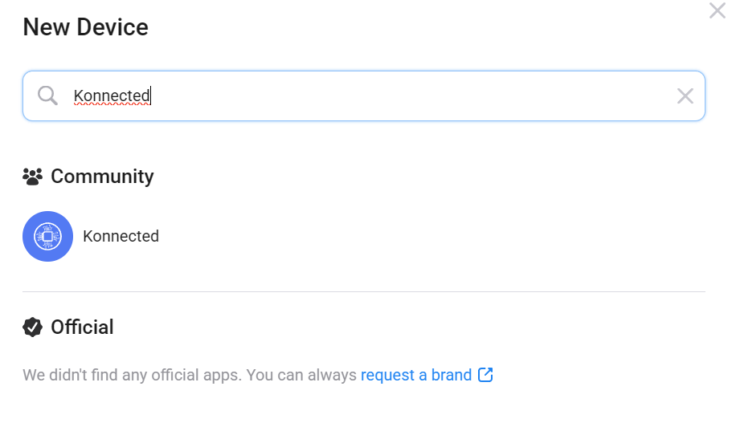
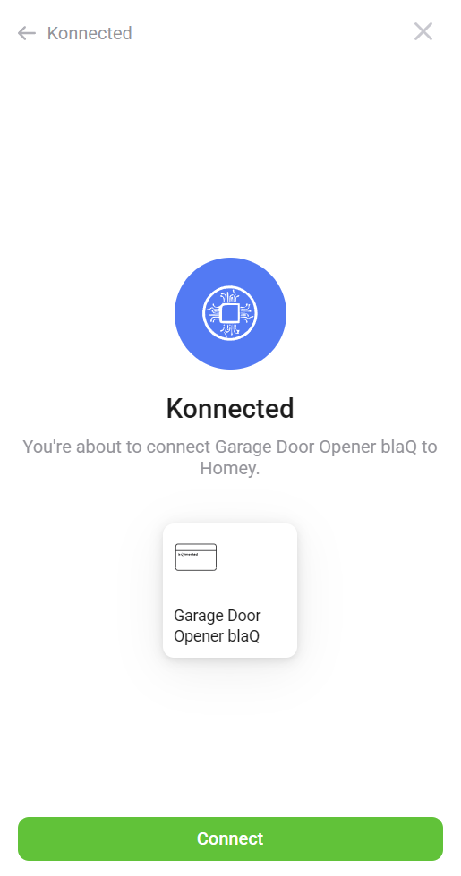
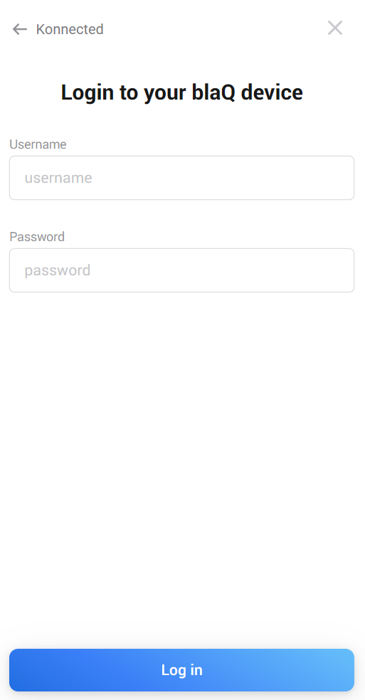

# blaQ Garage Door Opener for Homey

## Overview

This app seamlessly integrates your blaQ garage door opener into the Homey ecosystem. With this integration, you can effortlessly control your garage door, monitor its status in real-time, and automate its operation using Homey Flows. Using the Homey app, managing your garage door has never been easier.

All control is handled locally through the blaQ's Local WebAPI, ensuring fast and secure operation. Real-time updates are provided using event monitoring, allowing you to stay informed about the status of your garage door without delays.

**Note:** For this integration to function properly, you need to configure your blaQ device to enable the Local WebAPI, with or without a password.

## About the blaQ Garage Door Opener

The blaQ Garage Door Opener is a smart, Wi-Fi-enabled device designed to provide seamless remote control over your garage door. It serves as a reliable alternative to MyQ, offering full local control without reliance on cloud services. The device integrates easily with smart home ecosystems, providing real-time status monitoring and automation capabilities.

You can purchase the blaQ Garage Door Opener from [Konnected](https://konnected.io/products/smart-garage-door-opener-blaq-myq-alternative).

## Communication Between the App and the Device

The Homey app communicates with the blaQ Garage Door Opener using two key mechanisms:

1. **EventSource for Real-Time Updates:** The app establishes a persistent connection to the device's EventSource endpoint, allowing it to receive instant status updates whenever the garage door state changes.
2. **WebAPI Calls for Actions:** When you issue a command, such as opening or closing the garage door, the app makes a direct request to the device's Local WebAPI, ensuring fast and secure execution of actions.

This local-first approach ensures low latency, enhanced reliability, and full control without the need for external cloud services.

For more details, refer to the official API documentation at [Konnected API Docs](https://konnected.readme.io/reference/gdo-blaq-introduction).

## Adding to Homey

Follow these steps to add a blaQ Garage Door Opener to your Homey system:

1. **Open the Homey App**  
    Navigate to the "Add Device" section, type `Konnected` in the search bar, and select the Konnected Community app.  
    

    
    

2. **Select the Device Type**  
    Choose `Garage Door Opener blaQ` from the list of available devices.

3. **Initiate Discovery**  
    Click `Connect`. The Konnected blaQ driver will search your Homey's local network for devices broadcasting the Multicast-DNS Service Discovery with a `project_name` prefix of `konnected.garage-door` and `web_api` set to `true`.  
    For more details, refer to the [Discovery via mDNS](https://konnected.readme.io/reference/introduction-1#discovery-via-mdns) section in the Konnected documentation.  
    ℹ️ **Note:**  
    - Ensure the Web API function is enabled on your device.  
    - Verify that your network allows mDNS broadcasts to reach your Homey.  
    - Devices already added will not appear in the discovery list until removed.  
    

    
    

4. **Select Your Device**  
    From the list of discovered devices, select the one you want to add. The default name will be the broadcasted friendly name in the format `GDO blaQ {shortened MAC address}` (e.g., `GDO blaQ 1234fc`).

5. **Proceed with Configuration**  
    Click `Continue` to proceed.

6. **Enter Credentials (if applicable)**  
    If your device's Web API is password-protected (recommended), you will be prompted to enter the username and password.  
    If the API is not secured, this step will be skipped.  
    

    
    

7. **Complete the Setup**  
    Once the configuration is complete, your blaQ Garage Door Opener will be successfully added to Homey.

You’re all set!